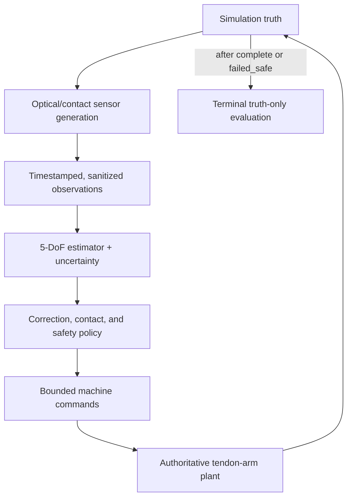

# Observed-state single-arm manipulation M1e

M1e is the preserved schema-v1 baseline. The opt-in [M1f extension](FIXED_HEAD_MANIPULATION_M1F.md)
adds a fixed observer and executed position/axis corrections under schema 2. The
M1e-specific shortcuts and limits described below still apply to M1e.

Status: modeled deterministic vertical slice; not hardware-qualified

M1e is the first Pipe milestone in which optical measurements, an uncertainty-bearing estimate,
and hardware-plausible contact evidence close the single-arm manipulation loop. It tests the core
claim that a low-cost tendon arm can manipulate a 0.40 mm calibration peg by repeatedly observing
the work, stopping, correcting, and guarding contact. It does **not** claim micrometre open-loop arm
accuracy.

The authoritative input is `scenarios/observed_manipulation_m1e_v1.json`. Its status is
`modeled_vertical_slice_not_hardware_qualified`, and its claim boundary is normative:

> Deterministic geometric-feature, pinhole, reduced compliance and force-proxy simulation only.
> No value is an achieved hardware precision or calibrated insertion force.

M1e is intentionally limited to one tendon-driven arm, one peg, one socket coupon, and one local
macro camera/projector head. Multi-arm handoff, gearbox execution, hardware selection, and a
general collision-free planner remain later work.

In this document, **must** and **requires** define acceptance obligations. A requirement is not an
implementation claim merely because it appears here; the implementation mapping in section 17
states which repository surfaces provide the executable evidence.

## 1. Closed loop and authority boundaries



The command loop may consume only:

- accepted machine commands and commanded-state history;
- calibrated machine, coupon, and optical parameters;
- timestamped `FeaturePointObservation` payloads;
- estimator snapshots derived from those payloads;
- sanitized jaw/contact/force-proxy evidence that represents a signal available on the intended
  hardware; and
- an estimated planning scene with explicit uncertainty.

Simulation truth is allowed only to synthesize sensor/contact observations and to calculate a
separately labelled post-run evaluation. It is forbidden in estimator updates, correction targets,
grasp/alignment/insertion/release decisions, controller-side collision preflight, seating decisions,
and runtime controller-visible acceptance gates, status, or hash. Overall integration acceptance
may inspect the terminal truth-only evaluation only after control has ended, as defined in section
13.

### 1.1 Strict truth firewall

`pipe_optics::FeaturePoint` is sensor-side truth: it contains a world point, surface normal,
material, and an optional carrier tag. It must never cross into the controller. The corresponding
controller-safe result is `FeaturePointObservation`:

- an observed sample contains object/feature IDs, the triangulation-head IDs, measured camera and
  projector pixels, a reconstructed point, covariance, quality metrics, and signal level; or
- a missing sample contains the same identities and an explicit missing-return reason.

Neither form contains the true point, true range, primitive index, or error against truth. The
older dense `DepthSample`, `SceneFrame`, plant bodies, attachment ownership, and exact FK error are
therefore not valid M1e controller inputs because they expose or colocate latent state.

The pure controller primitives are deliberately expressed in controller-visible value types.
Truth-firewall evidence must establish all of the following:

1. Replaying identical sanitized estimate/contact DTOs produces identical controller decisions;
   latent plant state is not a parameter of those pure functions.
2. Changing latent state affects control only after it causes a different sanitized observation.
3. Removing the truth-only evaluation payload does not change commands, phase transitions, or the
   controller-visible report hash.
4. A stale or invalid estimate cannot increment a near-contact command sequence.
5. Controller modules do not import plant, rigid-body, raw-depth, or renderer-frame types.

An exact simulator collision or attachment query may be used by the plant and evaluator to model
the physical result of a command. It must not be converted into privileged pose information for
the controller. The M1e planner preflights the estimated scene; contact reaches the controller only
as delayed, bounded evidence.

## 2. Frames, units, and the 5-DoF state

Persistent distances are metres, time is seconds, angles are radians, forces are newtons, and
covariance entries use the squared corresponding SI unit. The cell/world frame `C` is right-handed:
`+Z` follows the tube axis and `+X,+Y` span its radial plane. A pinhole camera uses `+Z` forward,
`+X` image-right, and `+Y` image-down; `world_from_camera` maps camera coordinates into `C`.
All persisted transforms must name their parent and child frames.

Scenario position errors, `calibration_bias_m`, `drift_per_burst_m`, and
`motion.loaded_hold_error_world_m` are vectors expressed in the world/cell frame. Each two-element
`initial_*_axis_tilt_rad` is composed as local `R_x(rx) R_y(ry)` after the calibrated object/tool
rotation; it is not a world Euler vector. Persisted distances are metres, time is seconds, angles
are radians, covariance entries are m^2 or rad^2 as named, and force proxies are newtons.

The peg and socket are treated as axisymmetric mating parts. Their relevant state is

$$
\mathbf{x}=[x, y, z, a_1, a_2],
$$

where `[x,y,z]` is a reference-point position and the two orientation coordinates describe a unit
axis on the sphere. Rotation about that axis is unobservable and immaterial to the reduced circular
peg/socket geometry. This is an **axisymmetric 5-DoF pose**, not a 6D pose with a zero roll error.

The runtime reference points are geometric centres, not mating surfaces. `B` is the peg-capsule
centre, `S` is the midpoint of the socket guide, and `T` is the distal tool centre between the jaws.
With unit axes `a_B` and `a_S`, the checked-in geometry is

$$
B_{tip}=B+0.900\,\mathrm{mm}\,a_B,\qquad
S_{entrance}=S-0.400\,\mathrm{mm}\,a_S,\qquad
S_{seat}=S+0.400\,\mathrm{mm}\,a_S.
$$

The 0.900 mm peg offset is its 0.700 mm cylindrical half-segment plus its 0.200 mm
hemispherical-cap radius. All insertion residuals are formed from peg tip to socket seat; a
centre-to-centre residual is not a seating error. At the nominal tail grasp,
`B = T + 0.750 mm a_B`.

The reduction is physically defensible only while all modeled geometry and task decisions are
roll-invariant. A keyed, non-circular peg, asymmetric gripper feature, or torque-about-axis task
would invalidate it and require explicit roll-sensitive feature geometry and a 6-DoF estimator.
The M1e tool target is fitted by this same axial model even though its side mount and the jaw body
are roll-asymmetric. Two target centrelines are surveyed symmetrically 0.800 mm along tool-local
`+/-X` from the tool axis. Both are observed independently and their measured ring-centre midpoint
publishes a tool-axis feature, so the offset cancels without consulting latent tool roll or pose.
The symmetric pair remains roll-invariant for this 5-DoF slice; a keyed task would still require
roll-sensitive target geometry and a 6-DoF estimate.
Orientation is inferred only from explicitly separated centreline-constraining geometry, such as
fitted ring centres or paired-feature midpoints. The calibrated model labels each such feature with
its signed coordinate on the object axis and fits

$$
\mathbf{p}_{measured}=\mathbf{c}_{world}+\hat{\mathbf{a}}_{world}s_{feature}.
$$

The socket's 0.50 mm feature span uses four fitted coded-ring centres at axial coordinates
`[-0.250, -0.225, 0.225, 0.250] mm`. They are realized on two external coded rails surveyed at
socket-local `+/-X = 1.000 mm`, outside the opaque socket walls. Each rail is observed independently
and the two measured ring-centre locations are averaged; the runtime never subtracts a
truth-pose-derived rail offset. The peg uses exposed stations
`[-0.350, -0.325, 0.025, 0.050] mm`; the known off-centre coordinates recover the declared peg
centre and give a 0.400 mm extreme span. The tool has the same four coded stations on two
0.100 mm-radius calibrated side targets at
`[-0.250, -0.225, 0.225, 0.250] mm`; each target cylinder extends to `+/-0.350 mm` and remains inside
the conservative 1.800 mm tool/jaw swept envelope. The targets are physical: versioned
oriented-box collision proxies contain both optical cylinders and participate independently in
socket-clearance checks. Their 0.800 mm symmetric lateral offsets cancel through the measured
midpoint described above. The central palm is recessed to tool-local
`z=-0.350 mm`; the volume ahead of that plane is an open jaw channel rather than a solid flange.
Observed 3-sigma palm/peg clearance is required before closure, and the plant independently rejects
physical palm/peg overlap before attachment. The peg's mean-centred RMS lever arm is approximately
0.188 mm; the symmetric socket/tool sets are approximately 0.238 mm. Their respective 0.400 and
0.500 mm extreme spans each exceed the configured 0.180 mm minimum accepted feature-span gate.
A point measurement or several measurements at one axial station never create an orientation
estimate.

At nominal seating, `B_tip = S_seat` gives `B = S - 0.500 mm a_S`. The four peg rings then lie at
socket-axis coordinates `[-0.850,-0.825,-0.475,-0.450] mm`, just outside the entrance at
`-0.400 mm`. This placement makes post-seat peg features optically available without claiming that
the opaque socket wall can be seen through.

## 3. Versioned baseline

The strict schema rejects unknown fields, invalid ranges, incomplete fault profiles, and any schema
version other than `1`. The source JSON is content-hashed and the hash belongs in every report.

### 3.1 Coupon and initial errors

| Parameter | Baseline |
| --- | ---: |
| Peg diameter | 0.400 mm |
| Peg cylindrical half-segment / straight segment length | 0.700 / 1.400 mm |
| Peg centre-to-tip offset / overall capsule length | 0.900 / 1.800 mm |
| Socket radial clearance | 0.125 mm |
| Socket full depth / centre-to-entrance or seat | 0.800 / 0.400 mm |
| Socket wall thickness | 0.200 mm |
| Axial feature scale / socket extreme span | 0.500 mm (peg 0.400 mm; tool 0.500 mm) |
| M1e jaw half-extents | 0.100 x 0.250 x 0.200 mm |
| Tool/socket paired-target offsets | 0.800 / 1.000 mm in local `+/-X` (`socket_fiducial_lateral_offset_m`) |
| Paired-target radius / axial half-extent | 0.100 / 0.350 mm |
| Nominal pickup point in `C` | `[20, 0, -6]` mm |
| Nominal socket point in `C` | `[20, 0, 6]` mm |
| Initial peg translation error | `[65, -45, 30]` um |
| Initial socket translation error | `[-10, 8, -6]` um |
| Initial tool-command translation error | `[90, -60, 40]` um |
| Initial peg two-axis tilt | `[0.0020, -0.0010]` rad |
| Initial socket two-axis tilt | `[0.0010, -0.0015]` rad |
| Initial distal-tool mounting/compliance tilt | `[-0.0010, 0.0005]` rad |

These errors initialize the plant and observation generator. They are not controller-visible
correction vectors.

### 3.2 Macro observer

| Parameter | Baseline |
| --- | ---: |
| Image size | 1280 x 800 px |
| Field at target | 3.000 x 2.500 mm |
| Perpendicular working distance | 15.000 mm |
| Effective camera/projector baseline | 12.000 mm |
| Logical patterns | 8 |
| Pattern rate | 240 Hz |
| Processing latency | 20 ms |
| Required stopped settling | 12 ms |
| Observation burst | 3 frames |
| Camera/projector localization sigma | 0.18/0.18 px |
| Correlated calibration floor | 3.0 um RMS |
| Nominal calibration bias | `[0.5, -0.4, 0.3]` um |
| Drift per burst | `[0.05, -0.03, 0.04]` um |
| Base/grazing dropout probability | 0.002 / 0.04 |
| Clear-wall signal scale | 0.82 |
| Minimum confidence | 0.20 |
| Required calibration-reference samples | 2 |
| Maximum calibration-reference residual | 8.0 um |
| Maximum measurement age | 60 ms |

The 12 mm baseline is an effective entrance-pupil separation, not a claim about board spacing. The
macro head is rolled so the 3.000 mm field axis follows the calibrated insertion axis projected
into the image plane; the 2.500 mm transverse field also covers both socket rails at `+/-1.000 mm`
and both tool targets at `+/-0.800 mm`. The long unobserved transfer first stages the peg tip
1.000 mm before the socket seat; after a fresh mating-feature burst, bounded stop-and-look
corrections establish the final 0.600 mm pre-insertion standoff. The
3.000 x 2.500 mm field is an M1e scenario change from M1d's 2.500 x 1.5625 mm candidate, not evidence from a
selected sensor. The
model uses the existing calibrated pinhole/Brown-Conrady camera implementation. Projection and
visibility use each sensor's physical pose after modeled drift; reconstruction uses nominal
calibration. This creates a calibration error instead of allowing reconstruction to know the
physical perturbation.

For each requested local region of interest, the baseline places the camera at
`ROI + [-6, 15, 0] mm` and the projector at `ROI + [6, 15, 0] mm`; both optical axes look at the
ROI. The resulting nominal slant range is about 16.155 mm. The current scenario uses zero nominal
Brown-Conrady distortion, although the shared camera type supports it. Moving this idealized head
with the ROI is a local-observer abstraction. Version 1 does not model a macro-head actuator,
repositioning time/error, swept collision geometry, cable motion, or a fixed physical mount that
can see every tile. A hardware bench must keep one rigid surveyed head fixed or treat every
repositioned pose as a measured/calibrated state; the simulated tiling policy is not evidence that
such motion is feasible.

The current tiled-ROI policy is explicit and controller-safe:

- pickup correction centres the head on the calibrated nominal pickup datum;
- socket correction and subsequent insertion reacquisitions centre it halfway between commanded
  tool position and the calibrated nominal socket datum;
- seating verification centres it on the nominal socket datum; and
- post-release retreat verification again uses the commanded-tool/socket midpoint.

For every tile, both devices look at the ROI. Their image-right axis is the calibrated socket axis
projected into the image plane. ROI and
head orientation use commanded state and calibrated geometry, never latent peg or socket pose.

A centreline feature is not declared visible from its latent centre alone. Each coded ring first
uses seven surface probes over the head-facing 120-degree arc at `-60, -40, -20, 0, 20, 40, 60`
degrees. At least three usable probes must bracket the nominal viewing meridian and span at least
40 degrees. Each probe counted as usable must be inside both finite images, in front of both
devices, illuminated with sufficient signal/confidence, and visible along both camera and projector
segments. Camera and projector occlusion remain distinct failure modes; all seven probes need not
succeed when the minimum usable arc is present.

Surface probes have no own-carrier occlusion exemption. The ray-end epsilon admits the near
surface, while the carrier's far side can self-shadow a probe; peg, socket, jaws, each target rail,
terminal link, and proximal arm links also have distinct tags and remain occluders. Only after the
surface-arc gate passes is the virtual fitted centre measured through the same structured-light path
with that one carrier removed; no other tag is ignored. This is a geometric visibility proxy for a coded-ring
or arc fit, not rendered-image detection, segmentation, or photometric ellipse fitting. The
triangulation/noise model is applied to the resulting virtual centre; M1e does not propagate probe
pixel errors through an actual ellipse/ring fit, so unmodeled feature-extraction uncertainty must be
added from the hardware coupon before qualification. A separate
rigid calibration point at the ROI is measured through the same camera/projector reconstruction to
produce the calibration-health residual. A burst is rejected when that residual exceeds the
configured 8.0 um `maximum_calibration_reference_residual_m`; its current reference scene is
otherwise empty and therefore does not test reference-target occlusion. For an accepted burst, one
third of the residual is treated as a conservative common translation sigma and applied once to
each object update; it is not divided by feature or frame count. The one-point reference does not
claim an orientation constraint.

The plant refuses acquisition while motion is active or before the settling interval has elapsed.
At each exposure tick it constructs the sensor-private optical scene from the then-current settled
peg, socket, jaw, tool-carrier, and arm-link geometry. Those physical poses remain on the sensor
generation side of the firewall; the controller receives only the sanitized observed/missing
feature records after latency.

One camera plus one projector yields **one triangulation head with two calibrated rays**. It is not
two independent optical heads. The baseline observability gate accordingly requires at least four
distinct features, one triangulation head, and two calibrated rays per reconstructed point. In the
estimator report, `head_count` is the number of unique calibrated heads, while `view_count` counts
unique `(head_id, capture_tick)` temporal views. Repeated frames from the same head can reduce
independent localization noise but must not divide down the once-only 3 um correlated calibration
floor.

The clear tube is represented here only by a signal multiplier plus configured bias/dropout. The
model does not trace refraction or multiple reflections through the wall.

### 3.3 Motion, contact, and safety limits

| Parameter | Baseline |
| --- | ---: |
| Pickup tail-axis start / macro-capture standoff | 2.000 / 1.000 mm behind the nominal peg centre along the calibrated axis |
| Capture relative position / axis bound | 0.120 mm / 0.010 rad |
| Socket transfer stage / final approach | Peg tip 1.000 / 0.600 mm before the socket seat along the calibrated insertion axis |
| Maximum correction / convergence | 0.400 mm / 0.009 mm |
| Maximum correction iterations | 8 |
| Maximum steps per motion | 20,000 |
| Insertion increment / maximum increments | 0.200 mm / 14 |
| Near-contact distance | 0.300 mm |
| Required obstacle clearance | 0.100 mm after uncertainty inflation |
| In-task recoverable-contact reverse distance | 1.000 mm |
| Maximum phase retries | 2 |

## 4. Time and observation envelopes

The scheduler is fixed-step. No control decision may depend on wall-clock time. Each observation
envelope records at least:

- a monotonic capture tick;
- an availability tick after exposure/pattern and processing latency;
- source head and camera/projector IDs;
- burst/frame identity;
- measured or explicitly missing feature payloads; and
- the scenario seed and stable object/feature identities needed for replay.

The runtime may deliver an observation only at or after its availability tick. Estimate age is
measured from capture, not from delivery. A measurement from the future, a capture after its stated
availability, or an age greater than 60 ms is invalid. Near-contact motion must Stop+hold rather
than use such an estimate; only a still-active recovery with a fresh preflight may retreat.

The authoritative scheduler step is 1 ms. A stopped acquisition requires 12 complete settling
ticks. The baseline coded pattern time is $8/240=33.333\ldots$ ms, rounded conservatively to a
34-tick capture interval. Three distinct exposure ticks are distributed deterministically through
that interval; all samples become visible together 20 ticks after the final exposure tick. Thus the
oldest nominal sample is 53 ticks old at delivery and remains within the 60 ms gate. The report
serializes the burst's capture-start, capture-end, and availability ticks. The estimator retains the
per-measurement capture times used for conservative age; neither layer relabels the common delivery
time as a fresh capture.

## 5. Estimator contract

M1e uses the smallest estimator justified by the measurements: deterministic weighted least
squares for the labelled centreline model, followed by bounded prediction between accepted updates.
Each burst replaces the preceding optical solution instead of recursively accumulating information;
the command-predicted prior is used for innovation checking. This prevents a shared calibration
floor from being mistaken for independent evidence. It is not an EKF and does not manufacture
unmeasured state.

Each estimator snapshot exposes:

- object ID and validity with an explicit invalid/degraded reason;
- 5-DoF reference position and unit axis;
- position and axis uncertainty;
- oldest/newest capture and availability ticks, conservative age from the oldest exposure, and
  maximum capture-to-availability latency;
- unique head/source count, unique `(head, capture)` view count, distinct accepted features, total
  calibrated rays, and minimum rays per accepted point;
- innovation or residual and rejection count; and
- whether the value is a measured update or prediction.

Feature fusion uses `KnownAxialFeature { feature_id, axial_coordinate_m }` and controller-safe
`FeatureMeasurement` records. A measurement contains object/feature/head identity, ray count,
capture/availability ticks, a measured 3D point, its independent diagonal covariance, and a
deterministic quality weight. Stable canonical ordering is mandatory. Centre uncertainty is stored
for `x/y/z`; orientation uncertainty is stored as two variances in a deterministic tangent basis of
the fitted unit axis. The correlated position and angular calibration components are applied once
after burst fusion, rather than copied into every feature. Axis covariance reflects the measured
lever arm; fewer than two axial stations, an insufficient lever arm, or a rank-deficient fit is
invalid.

The schema names the coupon-wide lower bound on available geometry
`coupon.minimum_feature_axial_span_m` (0.400 mm) and the estimator rejection threshold
`estimator.minimum_accepted_feature_span_m` (0.180 mm). The estimator evaluates the actual accepted
maximum-minus-minimum station coordinate; the configured coupon bound is not substituted for
missing measurements.

An observation is rejected or degrades the estimate when it has an unknown/duplicate identity,
invalid timestamp ordering, missing required geometry, non-finite/non-positive covariance,
insufficient confidence/rays, excessive burst span, inconsistent fitted axis scale, excessive
feature residual, or excessive innovation against the command-predicted prior. Innovation gates
absolute translation, axis angle, and an approximate normalized 5-DoF norm; the scenario limit for
the latter is 6 sigma. Outlier removal uses both normalized and absolute residuals, a bounded
removal count/fraction, and deterministic tie-breaking. The scenario-level absolute feature limit
is 25 um. A rejected outlier is recorded and cannot silently pull the estimate. Invalid reports
expose no usable pose; diagnostic fields are not a control back door.

Between measurements, translation is predicted only from controller-visible command history.
Uncertainty grows by the configured free-motion term of 20 um per metre travelled. At grasp, the
4 um held-transform term is combined conservatively and additively with the direct peg and tool
position sigmas because cross-object calibration covariance is not modeled. The independent
2 um/sqrt(s) loaded-hold process term grows with elapsed time in root-sum-square inside the
transform, after which composition with a fresh tool estimate is again additive. Prediction never
copies plant FK or exact attachment pose and preserves the original observation age. The loaded
transform remains uncertain even though the M1e plant may use a kinematic attachment internally.

Every point-position motion followed by local optical control is a deliberate moving-object
estimator boundary. The executive first propagates translation/process uncertainty for motion
safety, then invalidates the moving tool prior and, while carrying, the peg prior before the
mandatory stopped observation. The static socket estimator is preserved. Point IK changes distal
orientation, but M1e has no calibrated commanded-axis transition model; carrying the old moving
axis into an innovation gate would therefore be mathematically false. A runtime latch rejects any
subsequent near-contact command until a fresh valid tool (and held-peg, when applicable) burst has
cleared it. Each reset is reported as `invalidate_moving_pose_prior`; transfer also records
`begin_socket_reacquisition`. This is not a covariance shortcut or access to the new truth pose,
and within-burst outlier rejection remains active.

Phase gates are:

| Phase use | Maximum position sigma | Maximum axis sigma |
| --- | ---: | ---: |
| Macro capture/correction | 10 um | 0.035 rad |
| Guarded grasp | 12 um | 0.035 rad |
| Alignment/insertion/seat verification | 10 um | 0.035 rad |

All phase gates also require validity, freshness, at least four distinct features, one head, two
calibrated rays per point, and residual no greater than 25 um.

## 6. Stop-and-look correction

Every fine correction follows the same explicit state machine:

1. Command the authoritative machine runtime to enter the macro capture volume using calibrated
   datums, commanded state, and the most recent gated estimate—not latent pose.
2. Stop motion and wait at least 12 ms for settling.
3. Acquire the configured three-frame observation burst and preserve its capture timestamps.
4. Wait for availability, fuse accepted features, predict to the decision tick, and run the phase
   covariance, age, feature, view/ray, and residual gates.
5. If the observed residual is at most 9 um, record convergence without a motion command.
6. Otherwise command 85% of the observed correction, provided its magnitude is at most 400 um and
   it is physically reproducible.
7. Execute through the bounded tendon/FK machine interface at no more than 6 mm/s and 40 mm/s^2,
   settle, and repeat.

There are at most eight correction iterations per attempt. The minimum reproducible correction is
5 um in the baseline. If the configured floor is incompatible with the convergence band, the phase
fails explicitly as `correction_floor_too_large`; it does not oscillate until timeout. A correction
over 400 um is also rejected before motion. The enlarged authority accommodates the certified
departure of the joint-interpolated FK path from its endpoint chord; it is not an open-loop
accuracy claim.

Each correction record contains the phase, iteration, decision tick, measurement age, pre-command
residual, requested vector and magnitude, estimator position/axis sigma, and outcome. The matching
ordered decision record carries the bounded target, command sequence, relevant estimate views,
contact packet where applicable, and reason. Observation records separately preserve capture/end/
availability ticks, feature counts, requested/accepted object IDs, view/ray counts, and rejection
reasons; estimator residual or innovation rejection is visible through those records and the
decision reason rather than duplicated into every correction row.

## 7. Manipulator and disturbance model

All motion is submitted to the authoritative M1b/M1c machine runtime and its tendon/FK model.
Position commands remain bounded and synchronized; an encoder or tendon command is not relabelled
as distal tool truth. The M1e scenario adds only reduced, explicit non-idealities needed to exercise
observed correction:

- 18 um differential backlash/hysteresis contribution;
- loaded hold disturbance `[3, -2, 2]` um;
- 5 um minimum reproducible correction;
- 6 mm/s and 40 mm/s^2 correction velocity/acceleration limits;
- settling before every observation burst; and
- 4 um held-part transform uncertainty plus covariance growth in transfer.

Before authorization, motion uncertainty is propagated over the exact deterministic duration
returned by the authoritative tool-motion planner plus the required settling interval. The 20 s
`maximum_steps_per_motion` interval is a reject-only watchdog cap, not a claim that each correction
accumulates 20 s of hold noise. The swept envelope also includes a conservative three-sigma
equivalent of the configured hard correction-floor, backlash, and (while loaded) hold-error bounds.
The controller does not add a blind backlash take-up offset: correction components below the 5 um
reproducible floor are zeroed, the remaining vector cannot cross the observed target, and the next
stopped burst closes the residual loop.

These values are provisional scenario assumptions. The hardware coupon must replace them with
measured distributions; they are not motor, arm, or tool specifications.

The version-1 scenario configures both translation and two-axis tilt errors for the peg, socket, and
distal tool. Its 5-DoF estimator observes axis tilt so compatibility and uncertainty can be gated,
but the authoritative Cartesian command is a point-position command, not a constrained tool-axis
command. Therefore the nominal slice actively corrects translation only and relies on its small
configured tilts being compatible with the circular clearance/passive lead-in. It must reject a
larger observed axis mismatch rather than imply that it corrected orientation. Observed orientation
control is required before this contract can claim general 5-DoF alignment.

## 8. Guarded grasp and release

Grasp is a state transition supported jointly by observed geometry and contact evidence. It is
accepted only when:

- the peg and tool estimates pass the grasp uncertainty/freshness/feature gates;
- observed peg centre lies within the 18 um jaw capture limit;
- observed peg/tool axis mismatch is no greater than the separate 0.015 rad physical capture
  tolerance (the 0.035 rad estimator sigma gate is not used as a geometry tolerance);
- jaw closure geometry indicates bilateral contact;
- both pad deflections are between 2 and 24 um;
- the modeled grip-force proxy is between 0.005 and 0.150 N; and
- the nominal commanded pad compression is 20 um, chosen so the declared
  9 um stop-and-look residual can still produce bilateral contact; this is a
  modeled coupon setting, not a hardware-qualified force/compliance value.

Unconditional acquisition is forbidden. Missing unilateral/bilateral contact, excessive offset,
or an out-of-range deflection/force yields a recorded rejection. Once accepted, the simulator may
carry the peg as a kinematic attachment, but the controller sees an uncertain tool-to-peg transform,
not exact ownership. M1e does not model breakaway, frictional slip, or dynamic load transfer.

Release requires an opened-jaw command plus contact/geometry evidence that bilateral retention is
gone and a fresh observed/contact-supported seated state. Opening the gripper alone is not proof of
release. Nominal retreat begins only after release is verified. A recoverable in-task contact may
use a fresh, preflighted reverse move; a terminal failure always Stop+holds rather than inventing an
unobserved retreat that could drag the part through an obstacle.

## 9. Reduced insertion/contact model

Insertion advances in increments no larger than 0.200 mm, with at most 14 increments. The
controller gates freshness, uncertainty, required mating features, estimated swept clearance, and
force before every near-contact increment. The baseline lead-in region begins 0.300 mm before the
seat.

The plant emits only timestamped raw channels that could exist on hardware: jaw-contact bits,
per-pad deflection, an insertion-contact bit, and grip/insertion force proxies. It does not emit a
truth-derived `seated` or `jammed` verdict. A pure controller function combines that packet with
the fresh observed peg/socket relative pose and classifies one of:

| State | Meaning and allowed response |
| --- | --- |
| `free_motion` | No lead-in or seating contact; another guarded increment may be considered. |
| `lead_in_contact` | Expected initial contact inside the recoverable geometry; stop and observe. |
| `recoverable_lateral_contact` | Lateral error is no more than 95 um; unload, observe, realign, and retry within budget. |
| `excessive_interference` | Lateral error exceeds the recoverable region or geometry is impossible; Stop+hold and fail closed. |
| `seated` | Observed axial/lateral pose and contact proxy satisfy the seat gates. |
| `jammed` | Observed geometry/contact response is incompatible with progress; issue Stop, hold, and fail closed. An over-limit raw force is rejected before classification. |

The absolute geometric lateral limit is 140 um. Seating requires estimated lateral error no greater
than 30 um, axial error no greater than 18 um, and axis mismatch no greater than the separately
declared 0.025 rad physical mating tolerance, together with contact evidence consistent with a
seat. The estimator's 0.035 rad axis-sigma limit remains an uncertainty gate, not a mating
tolerance. The 0.025 rad value is a modeled circular-coupon geometry gate, not an axis-control
capability: it gives about 17.5 um transverse endpoint offset over the 0.70 mm peg half-segment and
about 20 um over the 0.8 mm socket full depth, below the modeled 125 um radial clearance. The arm still
has no independent orientation command; observed mean mismatch and axis sigma must pass their
separate gates. Force is a compliance proxy using 600 N/m lateral and 350 N/m axial stiffness, with a hard
0.080 N limit. It distinguishes free, lead-in, recoverable, excessive, seated, and jam states; it is
not a calibrated friction, stress, wear, or real insertion-force prediction.
The raw insertion-load channel is sampled and interlocked on every fixed tick of any active
held-part motion, including transit and correction labels; a motion label cannot bypass the
physical overload stop. Grip load is likewise interlocked on every active closure tick.

## 10. Estimated-scene collision and fail-closed safety

Planning operates on estimated objects and calibrated static geometry. The controller starts with
the endpoint chord swept by a conservative 1.800 mm gripper/tool envelope. Before submission, the
command-model preview samples the authoritative joint-interpolated FK path at 128 intervals and
adds a kinematic inter-sample path-length bound; the resulting one-sided departure from the chord
inflates the sweep. The preview also bounds tool-axis excursion from commanded joint travel. The plant validates this against
the calibrated fully-open M1e jaw geometry (approximately 1.632 mm tool-centred corner radius for
0.100 x 0.250 x 0.200 mm jaw half-extents) and the held peg reach, so a scenario cannot shrink the
proxy below the machine/coupon model. While carrying, it also checks the
peg in a separate sweep with a 0.950 mm envelope (greater than the capsule's 0.900 mm exact
centre-to-tip bound), uncertain tool-to-peg transform, the same path-departure bound, and an
additional rotation-of-held-offset bound. Moving and obstacle envelopes are
inflated by three position standard deviations, and every path must retain at least 0.100 mm
clearance. The nominal scenario contains two explicit world-frame coupon-fixture keep-out spheres
(`10031` and `10032`); their centers, radii, and calibration sigma are part of the scenario hash,
so nominal transfer preflight is non-vacuous. Obstacles are evaluated in stable ID order. The
socket mouth is intentionally handled by the guarded contact policy rather than treated as a
phase-independent forbidden sphere.

This controller-side test is deliberately conservative but reduced: it is an analytic
inflated segment/sphere envelope with a certified command-model path-departure bound, not a
continuous narrow-phase proof over exact jaw, tendon, cable, and mesh geometry.
The report must call it a reduced analytic preflight. The peg may be excluded only from collision with the jaw surfaces
that intentionally hold it; it remains active against arm links, socket exteriors, fixtures, and
other obstacles. Intended insertion contact is phase-scoped rather than globally filtered out.

No near-contact command is permitted when any of these conditions holds:

- estimator invalid, future-dated, stale, or over the phase uncertainty budget;
- required feature missing or occluded;
- too few heads/rays or excessive observation residual/innovation;
- requested correction exceeds its magnitude, velocity, acceleration, or reproducibility limit;
- estimated swept clearance is below the uncertainty-inflated gate;
- carried-part clearance fails;
- grasp-force proxy exceeds 0.150 N, or insertion-force proxy exceeds 0.080 N;
- geometry is impossible; or
- correction, insertion, or phase retry budget is exhausted.

## 11. Executive phases and recovery policy

The ordered phases are `initialize`, `enter_capture`, `pick_correction`, `guarded_grasp`, `transfer`,
`socket_correction`, `guarded_insertion`, `seat_verification`, `release`, `retreat`, and `complete`.
Any unrecovered fault enters `failed_safe` with one terminal reason.

The baseline permits two retries after the first observation attempt, for three total attempts.
Loss of a usable observation causes a stop, a new settling interval, and a fresh burst; no new
near-contact motion is allowed while reacquiring. Exhausting that budget enters `failed_safe`.
Terminal failure always requests the authoritative Stop command, records whether that command was
accepted and its sequence, and holds; it never invents an axis or performs an unobserved/
un-preflighted retreat. Recoverable lateral contact inside the active task, before terminal failure,
may cause a bounded reverse correction followed by stop, settling, and optical reacquisition when
the contemporaneous estimates and swept corridor remain valid. Collision risk, impossible
geometry, excessive force, an incompatible correction floor, or exhausted correction/insertion
budgets is never converted into a generic timeout. A retry never resets the scenario seed or sensor
history.

## 12. Structured report and determinism

Report schema version 1 contains:

- report/scenario schema versions, scenario ID/content hash, machine-config ID/content hash, seed,
  injected fault, fixed step, and the exact fidelity label
  `F1_reduced_M1e_observed_feature_geometry_not_hardware_qualified`;
- terminal phase, outcome, exact reason, and whether the nominal observed retreat completed
  (terminal faults record Stop+hold instead of claiming an unvalidated retreat);
- timestamped burst summaries, source/ray counts, accepted object IDs, calibration-reference
  residual/sample-count/threshold/validity, and explicit rejection reasons;
- full estimator-update records with the applied phase limits, acceptance outcome, covariance,
  tangent basis, innovation, residual, provenance, prediction status, and rejected measurements;
- ordered uncertainty-guard records for single and relative estimates, including object IDs,
  position/axis sigma, applied limits, phase, tick, and result;
- decision-local estimate views with validity, position/axis, worst position/axis sigma,
  capture/availability ticks, feature/head/ray counts, and residual;
- every stop-and-look correction iteration with requested correction and scalar estimator gates;
- every bounded command/decision, phase, tick, reason, near-contact flag, and contact packet;
- raw-to-classified grasp/contact evidence, insertion state, separate
  `maximum_grip_force_proxy_n` and `maximum_insertion_force_proxy_n` metrics, transfer-preflight
  outcome, per-tick force-interlock trips, calibrated obstacle-check count, and minimum predicted
  clearance;
- retry counters and every gate result;
- controller-visible acceptance results; and
- after terminal control only, an optional separately labelled truth-only evaluation containing
  final physical errors and separate fixed-step peak grip/insertion proxies; the field is `null`
  in ready/running reports.

Each `EstimatorUpdateRecord` embeds the full `PoseEstimate`, so covariance tangent bases,
innovations, prediction status, and individual rejected measurements are preserved in the report
rather than only in an internal API.

The report must never mix a truth-derived metric into a controller decision or controller-visible
acceptance gate.
`evaluation_only_truth` is an `Option`: ready and running reports serialize it as `null`, and the
plant evaluator is not invoked while control is non-terminal. Only after the phase reaches
`complete` or `failed_safe`, when control has ended, may the field contain a truth-derived scoring
payload. That payload is diagnostic even when its `within_declared_seat_tolerances` member is true;
it cannot rescue or fail a controller-visible gate.

`controller_report_sha256` is computed over a canonical payload described as
`scenario+machine_config+fault+terminal+timing+controller_metrics+observations+estimator_updates+uncertainty_guards+force_interlocks+corrections+decisions+gates`; the
hash field and `evaluation_only_truth` are excluded. Thus omitting or changing terminal physical
scoring cannot alter command-trace identity. There is no truth-derived gate in the runtime
`acceptance_gates` vector.

Determinism requires fixed-step scheduling, seeded/keyed noise, stable object/feature/head/obstacle
ordering, explicit SI values, no wall-clock decisions, and stable serialization. Repeating the same
schema-v1 scenario and seed must produce byte-identical relevant reports and hashes natively. The
same core is compiled for `wasm32-unknown-unknown`; adapters must not reimplement control or sensor
physics.

## 13. Nominal executable acceptance gates

The nominal run passes only when every gate below is true:

| Exact gate ID | Required result |
| --- | --- |
| `no_controller_truth_access` | Controller/estimator source firewall and sanitized input contract hold. |
| `observed_acquisition` | Required PEG+TOOL pickup features and PEG+SOCKET+TOOL mating features are accepted from timestamped bursts. |
| `estimator_phase_uncertainty` | Pick, grasp, transfer, socket-correction, insertion, seating, release, and retreat phases all have passing guard evidence. Position-sigma budgets are 10/12/40/10 um for macro/grasp/transfer/insertion use; axis-sigma budgets are 0.035 rad except the 0.060 rad transfer-only safety budget. A global comparison only with the loosest phase is insufficient. |
| `correction_convergence` | Both nominal stop-and-look stages converge; each residual is <= 9 um within its iteration budget. |
| `guarded_grasp` | Centre offset <= 18 um, bilateral 2--24 um pad contact, and 0.005--0.150 N grip proxy. |
| `collision_free_transfer` | Separate tool/carried-peg uncertainty-inflated sweeps pass and the bounded transfer completes. |
| `guarded_insertion` | The nominal run advances only through preflighted bounded increments with fresh estimates and reaches a contact-supported seat; increment count alone is insufficient. |
| `observed_and_contact_seat` | Fresh observed relative pose and contact state jointly verify the seat. |
| `no_stale_near_contact_command` | Count is exactly zero. |
| `force_proxy_limit` | Grip/insertion peaks remain <= 0.150/0.080 N respectively and no per-tick force interlock trips. |
| `safe_release_and_retreat` | Contact-supported release and observed safe retreat both complete. |
| `explicit_fidelity_contract` | Scenario/report retain the exact modeled, not-hardware-qualified status/label and axisymmetric roll-unobservable state. |

The aggregate `estimator_phase_uncertainty` gate does not replace the decision-local estimator
guards. Before the corresponding transition, those still require a valid estimate, age <= 60 ms,
position sigma <= 10/12/40/10 um for macro/grasp/transfer/insertion use, axis sigma <= 0.035 rad
(0.060 rad only for transfer safety propagation), residual
<= 25 um, and the required feature/head/ray counts. Deterministic replay is an executable test, not
a self-referential runtime claim. The exact fidelity label is checked both by report-contract tests
and by the explicit runtime gate above.

Each gate includes `applicable` and `passed`. Nominal-success gates in an injected-fault run are
reported as `applicable=false, passed=false`; they are never mislabeled as successful merely because
the run intentionally exercised a failure path. Truth-firewall, stale-command, force-limit, and
explicit-fidelity gates remain applicable to every run.

Overall M1e integration acceptance then applies a deliberately separate terminal scoring check. The
report must contain `evaluation_only_truth`, `within_declared_seat_tolerances` and
`physical_release_verified` must be true, and `maximum_unplanned_penetration_m` must equal zero. The
truth-side peak grip and insertion proxies must not exceed their corresponding controller-reported
maxima, and the controller report must confirm retreat. `physical_release_verified` includes absence
of the physical attachment after a committed grasp and release. The controller gates independently
enforce the configured force ceilings and the observed release/retreat policy. Any reported final
tool-centre/socket-centre separation is only a distance diagnostic, not surface clearance; safe
retreat is established by the observed controller guard plus zero truth-only unplanned penetration.
These assertions occur only after the controller has terminated. They are not runtime controller
gates, do not change report `status` or `expected_outcome_observed`, and are excluded from
`controller_report_sha256`. The remaining truth-only physical errors and plant state are diagnostic.

## 14. Required fault-injection matrix

The schema contains exactly these ten non-nominal profiles. Each must terminate for the exact
configured reason rather than by step exhaustion. After any terminal fault the authoritative
response is Stop+hold; descriptions below mention retry or refusal only before that terminal
transition.

| Fault profile | Exact terminal reason | Expected fail-closed behavior |
| --- | --- | --- |
| `optical_dropout` | `optical_dropout` | Retry fresh bursts within budget without near-contact motion, then Stop+hold. |
| `excessive_calibration_bias` | `excessive_calibration_bias` | Reject biased alignment evidence before grasp or insertion, then Stop+hold. |
| `stale_observation` | `stale_measurement` | Never issue a near-contact command from the stale estimate; Stop+hold. |
| `correction_floor_too_large` | `correction_floor_too_large` | Detect incompatible correction/convergence limits without oscillation, then Stop+hold. |
| `grasp_outside_capture` | `grasp_outside_capture_region` | Refuse attachment and Stop+hold; do not invent a retreat axis. |
| `insertion_jam` | `insertion_jam` | Detect incompatible observed progress/contact before the force ceiling, issue Stop, and hold; no unobserved unload vector is allowed after terminal failure. |
| `occluded_mating_feature` | `required_mating_feature_occluded` | Attempt allowed stopped reacquisition, then Stop+hold outside contact without an unobserved retreat. |
| `carried_part_collision` | `carried_part_collision_risk` | Reject transfer before command submission, retain the grasp, and Stop+hold. |
| `inconsistent_observation` | `observation_outlier` | Reject the high-innovation/residual sample; Stop+hold if no consistent estimate remains. |
| `non_convergence` | `correction_non_convergence` | Stop+hold after the configured correction budget without a generic timeout. |

The deterministic `insertion_jam` injector sets the predicted, post-command peg-tip lateral error
in the socket frame to 6 um beyond the 140 um classifier boundary; it does not add an offset to a
seed-dependent residual. Scenario validation admits this fault only when that target, one complete
insertion increment of axial proxy load, and a reserved 5% force headroom remain below the
independent force-interlock limit. This is fault-fixture bookkeeping, not controller-visible state.

## 15. Native and WASM contract

The implemented Rust library facade is `ObservedManipulationRuntime`; it loads the embedded strict
scenario or validated scenario JSON, selects `none` or one named fault, runs to `complete` or
`failed_safe`, and returns report schema version 1. Invalid scenario input is an execution error; an
intentionally injected, correctly classified controlled failure is a valid report but not a nominal
acceptance pass.

The native entry point is the `pipe-observed-manipulation` binary in `pipe_sim_cli`. It accepts
`--scenario PATH`, `--fault NAME`, `--report PATH`, `--compact`, and `--help`/`-h`. Without an
explicit scenario it uses the checked-in versioned baseline. Once a run reaches report
serialization, the CLI writes its JSON to stdout before attempting the optional report-file copy.
`--report PATH` writes the same JSON document to that second destination, while `--report -` leaves
stdout as the only destination. Scenario and report paths that resolve to the same file are rejected
before execution. Argument, input, execution, or serialization failures occur before JSON output; a
later report-file failure leaves the already emitted stdout JSON intact. Output is pretty-printed
unless `--compact` is selected. For a named injected fault, exit status is 0 only when
`expected_outcome_observed` is true and every applicable safety gate passes: the runtime must stop
for that profile's exact declared reason without violating an earlier guard. A nominal exit status
of 0 additionally requires every controller gate plus the terminal scoring conditions in Section 13.
Status 2 means those expected acceptance conditions were not met, and status 1 denotes an argument,
input, execution, serialization, report-write, or stdout-write error. A nominal compact run is:

```sh
cargo run --locked -p pipe_sim_cli --bin pipe-observed-manipulation -- --compact
```

`pipe_sim_wasm` exports the same Rust executive as JavaScript class
`ObservedManipulationSimulator`. Its constructor accepts an optional fault name, and
`fromScenarioJson(scenarioJson, fault)` accepts explicit versioned input. `runCycleJson(pretty)`
executes the complete fixed-step cycle; `reportJson(pretty)` serializes the current ready, running,
or terminal report. The `terminal`, `completed`, `status`, and `controllerReportSha256` getters
expose status without duplicating policy. The helper exports
`observedManipulationReportSchemaVersion`, `observedManipulationScenarioSchemaVersion`, and
`availableObservedManipulationFaultsJson` expose contract metadata. This is presently a full-cycle
wrapper, not a stepwise browser scene viewer. The JSON preserves each estimate's
`direct_feature_fit` or `held_transform_from_fresh_tool` provenance rather than flattening a
derived held-part pose into an apparent observation. Host-side wrapper tests compare repeated
report JSON and controller hashes, and CI compiles the same core for `wasm32-unknown-unknown`. An actual
JavaScript/WASM-versus-native golden execution comparison is deferred and is therefore not claimed
as demonstrated parity; all sensor, estimator, executive, and report policy still resides in the
shared authoritative Rust core.

## 16. Fidelity boundary and hardware bridge

M1e is a geometric-feature and reduced-contact simulation. It includes finite calibrated pinhole
camera/projector fields, two-ray triangulation, ray occlusion, localization noise, keyed dropout,
signal/angle quality, latency, drift, correlated calibration uncertainty, 5-DoF geometric fusion,
bounded tendon-arm corrections, reduced backlash/hold error, uncertain kinematic attachment,
estimated swept envelopes, and a compliance/force state proxy.

It does **not** include rendered image formation, detector algorithms, correspondence ambiguity,
lens MTF/defocus, rolling exposure, projector code decoding, transparent-wall refraction or
multipath, glare correlations, thermal/structural calibration drift validated from hardware,
gravity-resolved peg dynamics, friction, calibrated pad stiffness, breakable/slipping grasps,
contact-derived calibrated wrench sensing, stress/wear, continuous exact collision meshes, or hardware timing.
Feature identities and local geometry are known to the synthetic observer. Roll is intentionally
unobservable. Version 1 injects and gates two-axis tilt but does not command an orientation
correction. The kinematic attachment remains a reduced plant convenience. The tiled macro observer
is synthesized at each requested ROI; its physical repositioning mechanism, pose uncertainty,
settling, and collision envelope are not modeled.

The external socket target rails are present in the optical occlusion scene but are not separate
mechanics collision bodies in version 1. Their checked-in `+/-1.000 mm` placement is assumed outside
the nominal insertion corridor; arbitrary target relocation is not collision-certified until the
rails are represented by calibrated keep-outs or physical solids.

The modeled M1d macro precisions of approximately 3.0 um lateral RMS and 3.4 um depth RMS, and its
approximately 7.9 um guarded-insertion loaded correction allocation, remain hypotheses. They are
not achieved arm precision or hardware-qualified metrology.

`docs/HARDWARE_COUPON_M1E.md` defines the bench bridge: two global coupon views plus one rigid macro
observer, one loaded tendon arm, one pointer/peg, one socket coupon, intended clear-tube material,
held-out calibration, timing/trigger characterization, loaded hold jitter, 5/10/20/50 um correction
tests, minimum repeatable correction extraction, capture-to-estimate latency, wall bias/dropout,
grasp compliance, and guarded insertion trials. Its measured distributions must replace these
scenario assumptions before any hardware precision or insertion-force claim is allowed.

## 17. Implementation and evidence mapping

The implementation is organized so the truth boundary is visible in source, rather than enforced
only by convention:

| Contract surface | Repository evidence |
| --- | --- |
| Strict versioned scenario and ten exact fault profiles | `scenarios/observed_manipulation_m1e_v1.json`; `observed_manipulation/scenario.rs` |
| Geometric camera/projector feature observations without truth fields | `pipe_optics::StructuredLightRig::observe_feature_points`; `FeaturePointObservation` |
| 5-DoF weighted estimator, covariance, prediction, rejection, and deterministic tests | `observed_manipulation/estimator.rs` |
| Truth-free estimate/correction/contact/collision decision primitives | `observed_manipulation/controller.rs` |
| Structured report and truth-only evaluation separation | `observed_manipulation/report.rs` |
| Single-arm phase executive, retries, fault mapping, report hashing, and end-to-end tests | `observed_manipulation/runtime.rs` |
| Private truth-owning machine/optics/contact adapter | `observed_manipulation/plant.rs` |
| Native report CLI | `pipe_sim_cli/src/bin/pipe-observed-manipulation.rs` |
| WASM wrapper, host replay test, and `wasm32-unknown-unknown` build | `pipe_sim_wasm::ObservedManipulationSimulator`; `pipe_sim_wasm/src/lib.rs` |
| Bench replacement of modeled distributions | `docs/HARDWARE_COUPON_M1E.md` |

The runtime tests cover nominal completion, exact replay, the configured terminal reasons,
hash-scope separation, non-terminal absence of truth evaluation, and forbidden raw optical fields
in decisions. Pure-controller tests perturb only sanitized peg/contact inputs and verify the
corresponding decision changes while identical sanitized inputs replay exactly. Source-boundary
tests reject plant/raw-observation imports from estimator and controller modules. This is strong
structural and DTO-level evidence, but it is not yet a full executive counterfactual harness that
replays one captured transcript against arbitrary alternative latent worlds. Native CLI parsing and
black-box process tests cover byte-identical replay, the 0/1/2 exit contract, scenario/report alias
rejection, and output failures. WASM deterministic-report tests exercise the other implemented
adapter without creating a second control path.
