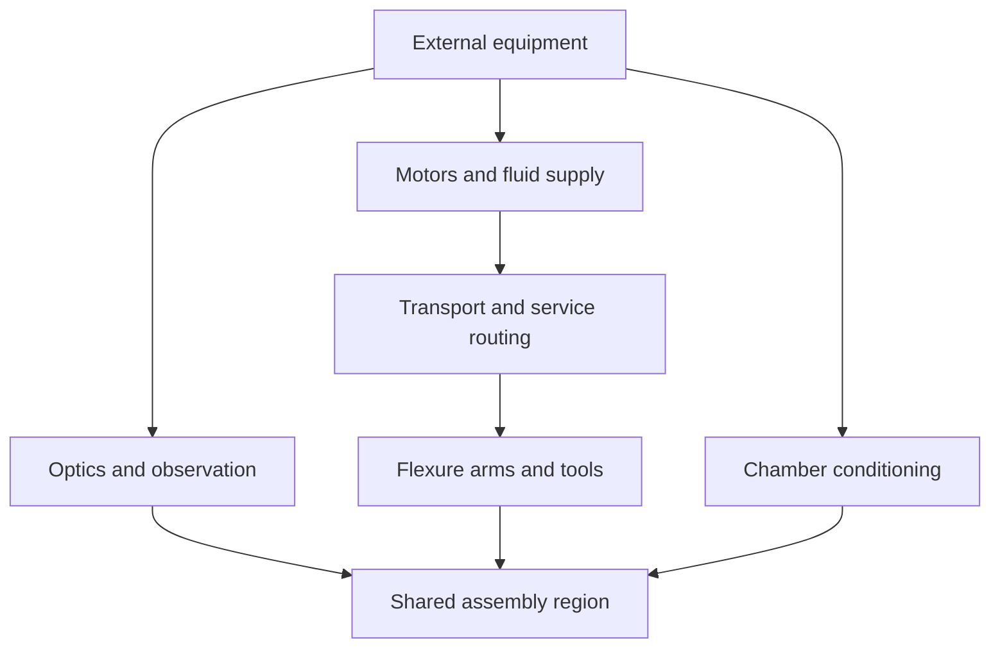

# Architecture — separate the scales, connect the roles

The Pipe µ has three physical layers. External equipment supplies observation, effort and conditioning. Transport and supports place arm shoulders near useful task regions. Tiny distal mechanisms interact with parts. The same machine can retain a large optical enclosure and have a much smaller local cooperative workspace.

This diagram describes functional relationships. It is not CAD or a rendered machine geometry.

## What each layer earns

External metrology earns geometric information. External actuators earn accessible effort and serviceability. Transport earns approach location. Distal arms earn local motion and interaction. Fixtures and other arms earn temporary constraint and receiving support. The enclosure earns a controllable environment. No layer can quietly stand in for another: observation does not provide stiffness, and accurate positioning does not establish release.

## Shared coordinate system, distinct workspaces

Use z for distance along the tube and θ for azimuth around its axis. Each arm has a shoulder frame, a deformable local mechanism and a tool frame. Parts and fixtures have observed frames. The assembly workspace is the region where useful arm reach, line of sight, safe motion and receiving support overlap.

The [scale document](scale-and-workspace.md) defines the dimensions. [Mobility and reach](mobility-and-reach.md) explains what the two base degrees of freedom do. [Service flows](energy-material-information.md) follows tendons, gas, liquid and observations through the chamber. [Spatial coordination](spatial-coordination.md) describes how arms share the volume.

## Browse this folder

- [Energy, material and information paths](energy-material-information.md)
- [Mobility and reach](mobility-and-reach.md)
- [Scale and workspace](scale-and-workspace.md)
- [Sharing the interior](spatial-coordination.md)

---

[Start](../README.md) · [Complete directory](../DIRECTORY.md)
