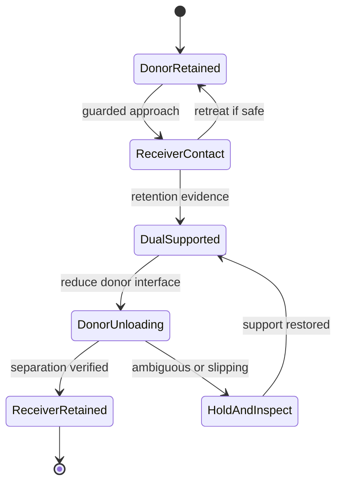

# Verified handoff and release

Handoff is a controlled transition between supporting interfaces. It includes a period where both donor and receiver can touch and support the part. Logical control responsibility can be assigned during that period, but physical donor release is complete only when separation and receiver retention have been established to the operation's required confidence.

## Conceptual states

The diagram is a behavioural model, not a claim that every failure can return safely to the previous state.

## Establish support before unloading

The receiver makes a controlled approach and engages its retention mechanism. That could be jaw closure, a fixture capture or a pressure interface. Evidence may combine visible deformation, tool/part relative pose, pressure state and a bounded verification motion. Mere image overlap is not evidence of a force margin.

The receiver need not have a higher maximum gripping force than the donor. It needs adequate support for the loads that remain while the donor changes its interface. Peel, opening and venting deliberately reduce those donor loads.

## Verify the transition

The donor unloads gradually within the operation's qualified range. The part should remain associated with the receiver or destination. The donor follows an observable separation path. The system checks for a suitable gap, stable retained pose and any evidence of dragging or residual connection.

If the observation is ambiguous, “release commanded” remains the correct description. A stuck jaw, residual meniscus or compliant bridge must not be silently converted into successful release because a software transaction changed an owner field.

## Recovery

If support is still secure, stop the transfer progression and inspect from a useful view. If a part slips, the available fixture, second arm and retained contact determine the response. Regrasp, re-engagement or parking can be candidates. Blindly increasing opposing forces can damage the component or store more elastic energy.

The same logic applies to placing a part in a fixture: establish destination retention, unload the tool, verify separation and inspect the final pose. Gravity remains in the physical model but is not the assumed transfer mechanism.

---

[Start](../../README.md) · [Parent folder](README.md) · [Complete directory](../../DIRECTORY.md)
